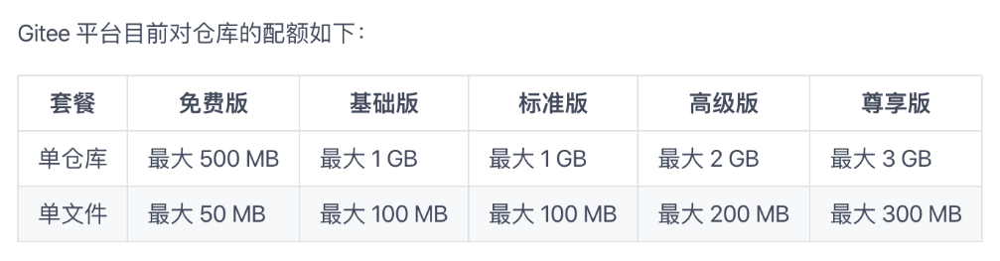
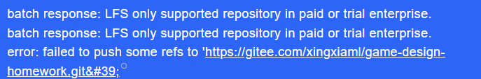
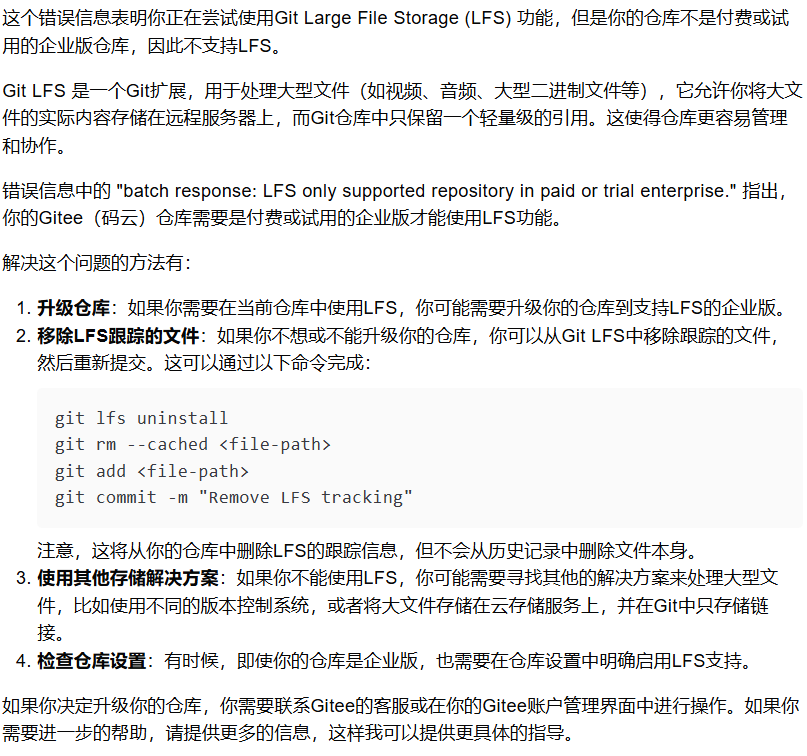

# Gitee尝试上传unity工程记录
————————————————————————————————————————
**首先说结论：项目大于500MB就无法上传了，我直接上传工程文件是1.9GB所以是失败的**

 ### 教程网址：https://cloud.tencent.com/developer/article/1862274
一直跟到上传之前都没有问题，当上传时，会要求输入账号密码，然后报错

报错内容为：

kimi的解释大约为文件过大，需要用LFS来上传，但LFS不充值是用不了的，所以无法上传工程文件

